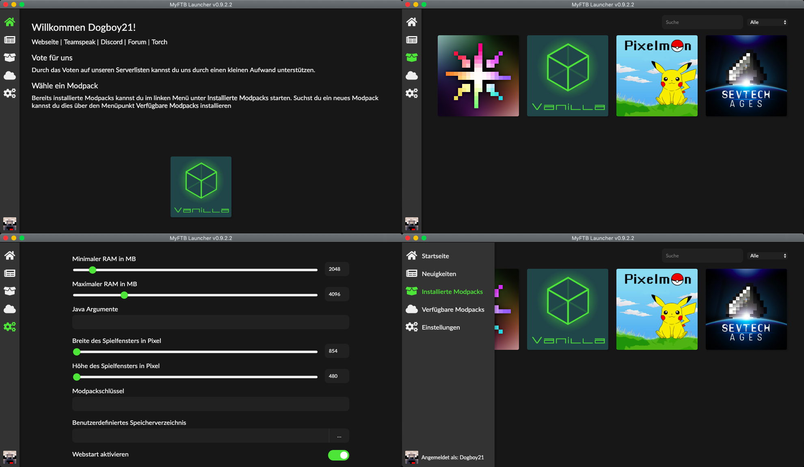

# MyFTB Launcher 

Dies ist das Repository für den MyFTB Launcher, der Bootstrapper für den Launcher ist [hier](https://github.com/MyFTB/launcher-bootstrap) zu finden.

Der MyFTB Launcher ist ein von Grund auf neu entwickelter Minecraft Modpack Launcher, entwickelt und verwendet von [MyFTB](https://myftb.de). Als Schema für Modpacks wird das des [SKLaunchers](https://github.com/SKCraft/Launcher) verwendet, es werden also immer noch dessen Creator Tools benötigt.

Der Launcher besteht aus 2 grundlegenden Bestandteilen:

- der Launcher, welcher in Java geschrieben ist ([src/main/java](src/main/java))
- dem Launcher-UI, welches in Javascript mit React geschrieben ist und mittels [JCEF](https://bitbucket.org/chromiumembedded/java-cef/src/master/) eingebunden ist ([src/main/ui](src/main/ui))

Beide Bestandteile kommunizieren über Interprocess Communication (IPC).

## Features

- modernes Design
- Unterstützt alle gängigen Plattformen (Windows, Linux, macOS)
- Discord Integration
- Neuigkeiten unserer Webseite direkt im Launcher integriert
- übersichtliche Modpackauflistung
- integrierte Java Installation für reibungslosere Installation und Modpackstarts
- korrekte Modpack-Versionen zum Betreten unserer Server

## Setup

Zunächst müssen alle benötigten Abhängigkeiten (JCEF, Java, UI) mittels `./gradlew setup` installiert werden.
Danach lässt sich der Launcher als Gradle Projekt in die IDE einbinden.

Da für das Starten des Launchers einige Startparameter notwendig sind, gibt es `./gradlew runLauncher` als Hilfsmittel.

> Das Starten des Launchers in der Entwicklungsumgebung ist aktuell nicht unter macOS möglich.

## Einen großen Dank an: / Special Thanks to:

[YourKit](https://www.yourkit.com), der Entwickler von [YourKit Java Profiler](https://www.yourkit.com/java/profiler/), [YourKit .NET Profiler](https://www.yourkit.com/.net/profiler/) und [YourKit YouMonitor](https://www.yourkit.com/youmonitor/), unterstützt Open Source Projekte mit innovativen und intelligenten Monitorung- und Profilerwerkzeugen für Java sowie .NET Anwendungen.
Vielen Dank für das Bereitstellen einer Open Source Lizenz für den MyFTB Launcher!

[YourKit](https://www.yourkit.com), the developer of [YourKit Java Profiler](https://www.yourkit.com/java/profiler/), [YourKit .NET Profiler](https://www.yourkit.com/.net/profiler/) and [YourKit YouMonitor](https://www.yourkit.com/youmonitor/), supports open source projects with innovative and intelligent tools for monitoring and profiling Java and .NET applications.
Thank you for providing an open source license to the MyFTB Launcher!
